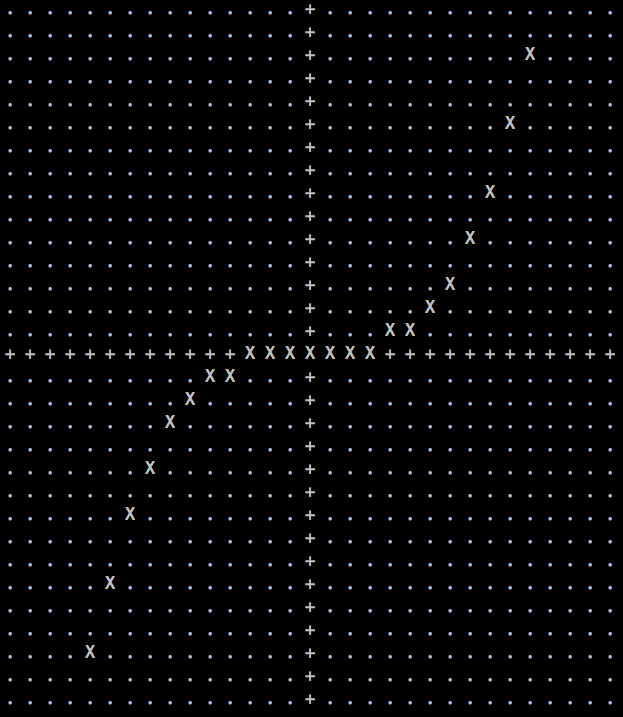
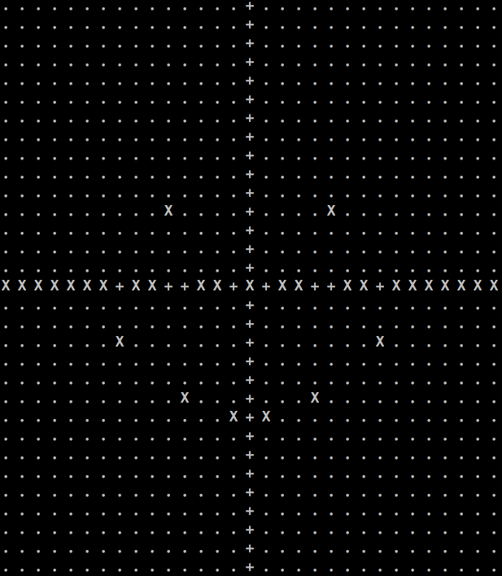

## Terminal_plotter

Simple terminal application for plotting functions or raw data in terminal directly.

## Building

`git clone https://github.com/AlexanderDKazakov/terminal_plotter.git`

`cd terminal_plotter`

`make`

You can find the application in `build/apps`

## Usage

`Usage: graph <size> <step> <function(x)>`

`Usage: graph <size> <filename>`

Example: `./terminal_plotter 15 0.1 "x^3"` 

Example: `./terminal_plotter 15 0.1 "sin(x)"` 

`./terminal_plotter 15 1 1 example/smile.dat`

